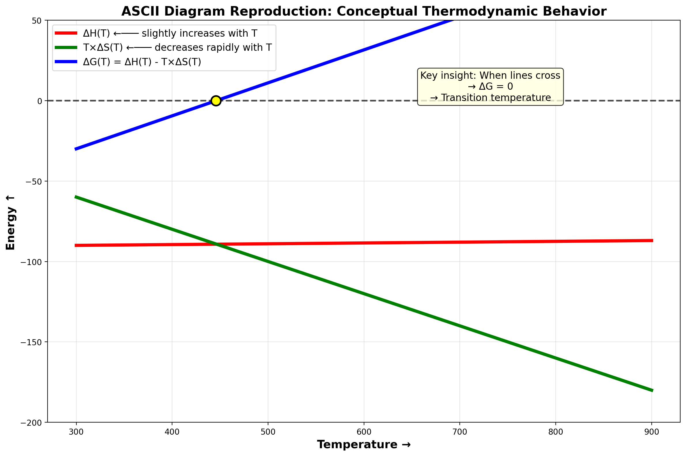
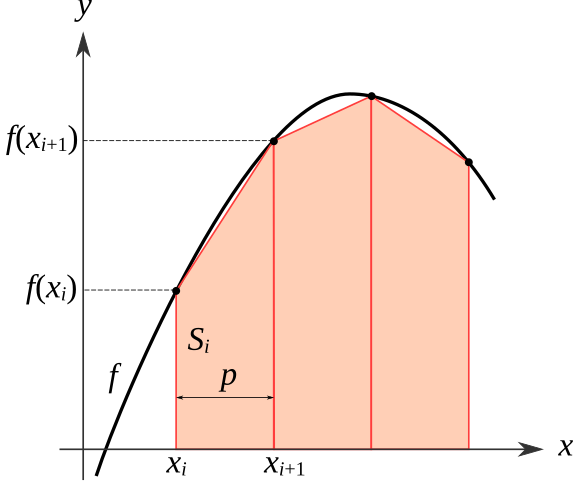

# Module 5: Reaction Spontaneity Analysis
## Temperature-Dependent Thermodynamics and Process Optimization

---

## Overview

In this module, you'll analyze how **temperature affects reaction spontaneity** for the industrial ammonia synthesis reaction (Haber-Bosch process). You'll discover why chemical engineers must balance **thermodynamic favorability** (ΔG < 0) with **reaction kinetics** (fast enough to be practical) when designing industrial reactors.

**Key challenge:** This is a **computational assignment** that requires using spreadsheet software or programming tools. Doing 61 temperature calculations by hand is impractical—this assignment teaches you how engineers use computational tools to solve real problems.

---

## Learning Objectives

By completing this module, you will:

1. **Calculate temperature-dependent thermodynamic properties** (ΔH(T), ΔS(T), ΔG(T))
2. **Implement numerical integration** (trapezoidal rule) for calculating property changes
3. **Understand empirical modeling** using polynomial approximations (Shomate equation)
4. **Visualize thermodynamic relationships** through meaningful plots
5. **Analyze trade-offs** between thermodynamics and kinetics in process design
6. **Use computational tools** (spreadsheets) to solve engineering problems efficiently

---

## The Problem: Ammonia Synthesis

### The Reaction

```
N₂(g) + 3 H₂(g) ⇌ 2 NH₃(g)
```

This reaction produces ammonia, the foundation of the fertilizer industry. It's one of the most important industrial processes in the world (feeds ~50% of global population!).

### The Challenge

- **At low temperature (300 K):**
  - ΔG is very negative (highly spontaneous thermodynamically) ✓
  - But reaction rate is extremely slow (takes years to reach equilibrium) ✗
  
- **At high temperature (900 K):**
  - Reaction rate is very fast (equilibrium in seconds) ✓
  - But ΔG becomes positive (reaction becomes non-spontaneous) ✗

### Your Mission

Find the "sweet spot" temperature where:  
1. The reaction is still thermodynamically favorable (ΔG < 0)  
2. The reaction rate is fast enough to be practical  
3. Understand why industrial plants operate where they do  

---

## Visual Guide: How Thermodynamic Properties Change with Temperature

Before diving into calculations, here's a conceptual sketch of what you'll discover:



**Key insights from this diagram:**
- **ΔH(T)** changes slowly with temperature (small positive slope)
- **T×ΔS(T)** increases much faster (steeper positive slope) 
- **ΔG(T)** starts negative but becomes positive when the lines cross
- **Intersection point** = transition temperature where ΔG = 0

---

## Why Heat Capacity Changes with Temperature

### Molecular Explanation

Heat capacity (Cp) tells us how much energy is needed to increase a substance's temperature by 1 K. But this value itself changes with temperature! Why?

Molecules can store energy in different ways:

1. **Translational motion** (moving through space)  
   - Active at all temperatures  
   - Always contributes to Cp  

2. **Rotational motion** (spinning)  
   - Active above ~100 K  
   - Adds to Cp as temperature increases  

3. **Vibrational motion** (bonds stretching/bending)  
   - "Turns on" at higher temperatures (>300 K)  
   - Major contributor to Cp increase with temperature  

4. **Electronic excitation** (electrons jumping to higher energy levels)
   - Only at very high temperatures (>1000 K)
   - Usually negligible for our temperature range

**The key insight:** As temperature increases, more energy storage modes become accessible, so the molecule can absorb more energy per degree of temperature increase.

**Example for N₂:**
- At 298 K: Cp ≈ 29.1 J/(mol·K) (translation + rotation)
- At 1000 K: Cp ≈ 32.7 J/(mol·K) (translation + rotation + vibration)

---

## Engineering Approach: Empirical Polynomial Models

### Why Polynomials?

In engineering, we rarely calculate molecular properties from quantum mechanics—it's too complex!  Instead, we:

1. **Measure Cp experimentally** at many temperatures (lab data)  
2. **Fit a polynomial curve** through the data points  
3. **Use the polynomial** for calculations  

This is called **empirical modeling**—using math to describe observed behavior.  

### The Shomate Equation

The most common form for heat capacity is:  

```
Cp(T) = a + bT + cT² + dT⁻²
```

Where **a, b, c, d** are fitted coefficients determined from experimental data.  They are not rooted in any theoretical model, just observations.  

**Each term represents (roughly):**  
- **a** (constant): Baseline from translation and rotation
- **bT** (linear): Captures vibrational contribution
- **cT²** (quadratic): Accounts for anharmonic vibrations at high T
- **dT⁻²** (inverse square): Corrects for quantum effects at low T

### Why This Matters for Engineers

**Advantages of polynomial approximations:**  
- ✓ Easy to integrate analytically (for ∫Cp dT calculations)
- ✓ Computationally efficient
- ✓ Accurate to <1% over practical temperature ranges
- ✓ Simple to implement in spreadsheets or code

**This same approach is used for:**  
- Vapor pressure vs. temperature (Antoine equation)
- Viscosity vs. temperature (Andrade equation)
- Density vs. temperature and pressure (equations of state)

**Key lesson:** Engineering is less about perfect physics—it's more about **useful approximations** that are accurate enough and practical to use.  

---

## Numerical Integration: Trapezoidal Rule

### Why Numerical Integration?

We need to calculate:
```
∫₂₉₈ᵀ ΔCp(T') dT'
```

But ΔCp(T) is a complex function of temperature. While we *could* integrate the polynomial analytically, in engineering practice we often use **numerical integration** because:
- It works for ANY function (even if we can't integrate it analytically)
- It's what computers do
- It's more flexible and generalizable

### The Trapezoidal Rule

**Idea:** Approximate the area under a curve using trapezoids.  

```  
∫ₐᵇ f(x) dx ≈ Σᵢ [(f(xᵢ) + f(xᵢ₊₁))/2] × Δx
```


    
Each trapezoid area = (height₁ + height₂)/2 × width
Total integral ≈ sum of all trapezoid areas

**For our problem:**    
- xᵢ = temperature points (298, 308, 318, ...)
- f(xᵢ) = ΔCp at each temperature    
- Δx = 10 K (our temperature step)
- Sum up all trapezoid areas from 298 K to current temperature T  

**Implementation in spreadsheet:**   
1. Calculate ΔCp at each temperature
2. For each interval, calculate: `(ΔCp[i] + ΔCp[i+1])/2 × 10`
3. Sum all intervals from 298 K to current T
4. This cumulative sum is your integral!


## What You'll Calculate

### Part 1: Standard Conditions (298 K)

Calculate the baseline thermodynamic properties:  

**ΔH°₂₉₈** = Σ ΔH°f(products) - Σ ΔH°f(reactants)  

**ΔS°₂₉₈** = Σ S°(products) - Σ S°(reactants)  

**ΔG°₂₉₈** = ΔH°₂₉₈ - T × ΔS°₂₉₈  

This is straightforward stoichiometry you've done before.  

---

### Part 2: Temperature-Dependent Properties (300-900 K)

**This is the computational heart of the assignment!**

For **61 different temperatures** (300, 310, 320, ..., 900 K):  

#### Essential Formulas for Temperature-Dependent Calculations

**1. Heat Capacity for Each Species (Shomate Equation):**
```
Cp(T) = a + bT/1000 + cT²/1,000,000 + d×100,000/T²
```
*Note: Watch the multipliers on b, c, and d coefficients!*

**2. Reaction Heat Capacity:**
```
ΔCp(T) = 2×Cp(NH₃) - [Cp(N₂) + 3×Cp(H₂)]
```

**3. Enthalpy Integration (Trapezoidal Rule):**
```
ΔH(T) = ΔH°₂₉₈ + ∫₂₉₈ᵀ ΔCp(T') dT'

For numerical integration:
ΔH(T) = ΔH°₂₉₈ + Σ[½ × (ΔCp(T₁) + ΔCp(T₂)) × ΔT]
```

**4. Entropy Integration (Trapezoidal Rule):**
```
ΔS(T) = ΔS°₂₉₈ + ∫₂₉₈ᵀ [ΔCp(T')/T'] dT'

For numerical integration:
ΔS(T) = ΔS°₂₉₈ + Σ[½ × (ΔCp(T₁)/T₁ + ΔCp(T₂)/T₂) × ΔT]
```

**5. Gibbs Free Energy:**
```
ΔG(T) = ΔH(T) - T × ΔS(T)
```

#### Computational Automation for 61 Temperature Points

**Excel Implementation Strategy:**

Since you're calculating 61 temperature points (300–900 K in 10 K steps), manual calculations are impractical. Here's is a quick suggestion on how to automate in a spreadsheet (further details below).  However, if you are more comfortable in the world of Python/Pandas, feel free to use those tools as well.  

**Spreadsheet Column Layout:**
```
Column A: Temperature (300, 310, 320, ..., 900)
Column B: Cp(N₂)     Column C: Cp(H₂)     Column D: Cp(NH₃)
Column E: ΔCp(T)
Column F: ΔCp/T (for entropy integration)
Column G: Trapezoid area for ΔH
Column H: Trapezoid area for ΔS  
Column I: ΔH(T) (cumulative sum)
Column J: ΔS(T) (cumulative sum)
Column K: T×ΔS(T)
Column L: ΔG(T)
```

**Formula Automation Tips:**
1. **Use absolute references** for Shomate coefficients: `=$B$2` not `=B2`
2. **Use fill-down operations** for all 61 rows
3. **Cumulative sums** use ranges like `=SUM($G$2:G2)` that expand as you copy down
4. **Temperature sequence**: Use `=300+10*(ROW()-2)` for automatic sequence

**Sample Calculation for T = 500 K:**

Let's work through one complete example before automating the rest:

**Step 1: Calculate Cp for each species at 500 K**
```
For N₂ (a=28.98, b=-1.571, c=0.808, d=-2.871):
Cp(N₂) = 28.98 + (-1.571×500/1000) + (0.808×500²/1,000,000) + (-2.871×100,000/500²)
       = 28.98 - 0.786 + 0.202 - 1.148
       = 27.25 J/(mol·K)
```

**Step 2: Calculate ΔCp for the reaction**
```
ΔCp(500K) = 2×Cp(NH₃) - [Cp(N₂) + 3×Cp(H₂)]
           = 2×(35.12) - [27.25 + 3×(29.89)]
           = 70.24 - 116.92
           = -46.68 J/(mol·K)
```

**Step 3: Trapezoidal integration element**
```
Area for ΔH = ½ × [ΔCp(490K) + ΔCp(500K)] × ΔT
            = ½ × [(-45.81) + (-46.68)] × 10
            = ½ × (-92.49) × 10
            = -462.5 J/mol
```

**Step 4: Add to cumulative sum**
```
ΔH(500K) = ΔH°₂₉₈ + Σ(all trapezoid areas from 298K to 500K)
```

**Now automate this process for all 61 temperatures using Excel formulas!**

---

### Part 3: Find the Transition Temperature

**Where does ΔG change from negative to positive?**

This is where the reaction switches from spontaneous to non-spontaneous. This temperature is **critical** for process design.

Method:
1. Look through your ΔG values
2. Find where the sign changes (negative → positive)
3. The transition temperature is between those two points
4. (Optional) Use linear interpolation for a more precise estimate

---

### Part 4: Create Visualizations

**Plot 1: ΔG vs. Temperature**  

Requirements:
- X-axis: Temperature (K)
- Y-axis: ΔG (kJ/mol)
- Show all 61 points as a line
- Mark transition temperature where ΔG = 0
- Add horizontal line at ΔG = 0
- Label spontaneous and non-spontaneous regions

**What this shows:** How thermodynamic favorability changes with temperature  

**Plot 2: ΔH and T×ΔS vs. Temperature**  

Requirements:  
- X-axis: Temperature (K)
- Y-axis: Energy (kJ/mol)
- Two lines: ΔH(T) and T×ΔS(T)
- Mark where lines cross (this is where ΔG = 0)

**What this shows:** The "competition" between enthalpy and entropy terms. Where they cross, ΔG = 0.  

---

### Part 5: Kinetics vs. Thermodynamics Trade-off

**New concept:** Temperature affects BOTH thermodynamics (ΔG) AND kinetics (reaction rate).  

**Rule of thumb:** Reaction rates approximately **double for every 10 K increase** in temperature.  

**Your analysis:**

1. **Calculate rate multipliers at different temperatures:**
   ```
   Rate multiplier = 2^(ΔT/10)
   
   Example: Going from 300 K to 450 K (ΔT = 150 K):
   Rate multiplier = 2^(150/10) = 2^15 ≈ 32,768
   
   The reaction is ~33,000 times faster at 450 K than at 300 K!
   ```

2. **Compare scenarios:**  

   | Temperature | ΔG | Rate vs. 300 K | Trade-off |  
   |-------------|-----|----------------|-----------|  
   | 300 K | Very negative | 1× (baseline) | Favorable but SLOW |  
   | T₀ - 100 K | Negative | ~1000× | Good balance? |  
   | T₀ - 50 K | Slightly negative | ~30,000× | Getting fast |
   | T₀ (transition) | 0 | ~1,000,000× | Fast but no driving force |
   | T₀ + 50 K | Positive | ~30M× | Very fast but unfavorable |

3. **Recommend an optimal temperature** where:  
   - ΔG is still negative (thermodynamically favorable)  
   - Rate is significantly faster than room temperature  
   - Justify your choice with calculations  


---

## Detailed Spreadsheet Implementation Guide

### Excel Setup Strategy

Note that this is just a suggestion, feel free to use your own setup.  I provide this just in case you want some hints to get started. 

**Row Organization:**
- Rows 1-20: Input data (Shomate coefficients, standard values)
- Row 21: Column headers  
- Rows 22-82: Temperature calculations (298, 308, 318, ..., 900 K)

**Key Formula Examples:**

**Temperature sequence (A22):**
```
=298+10*(ROW()-22)
```
*Copy down to generate 298, 308, 318, ..., 900 K automatically*

**Cp calculation (B22 for N₂):**
```
=$B$2+$C$2*A22/1000+$D$2*A22^2/1000000+$E$2*100000/A22^2
```
*Use absolute references for coefficients, relative for temperature*

**ΔCp calculation (E22):**
```
=2*D22-(B22+3*C22)
```

**Trapezoidal area for ΔH (G23):**
```
=0.5*(E22+E23)*(A23-A22)
```
*Start in row 23, not 22*

**Cumulative ΔH (I23):**
```
=$I$2+SUM($G$23:G23)
```
*I2 contains ΔH°₂₉₈, range expands as you copy down*

**Final ΔG (L22):**
```
=I22-A22*J22/1000
```
*Convert J to kJ by dividing entropy term by 1000*

### Quality Control Checks

Before proceeding to analysis:
- ✓ ΔG at 298 K should match your hand calculation
- ✓ ΔH should increase slowly with temperature  
- ✓ ΔS should increase gradually with temperature
- ✓ ΔG should start negative and become positive
- ✓ All Cp values should be reasonable (20-50 J/(mol·K))

---

## Advanced Excel Techniques

### Creating Professional Plots

**Plot 1: ΔG vs. T**

1. Select Temperature (A22:A82) and ΔG (L22:L82)
2. Insert → Scatter Plot → Lines
3. Add horizontal line at y=0:
   - Right-click chart → Add Trendline → Select "Linear"
   - Set intercept = 0, slope = 0
4. Format axes, add labels, title

**Plot 2: ΔH and T×ΔS vs. T**

1. Select Temperature (A22:A82), ΔH (I22:I82), and T×ΔS (K22:K82)
2. Insert → Scatter Plot → Lines with Multiple Series
3. Add legend to distinguish the two lines
4. Add chart title, axis labels

### Quality Checklist

Your plots should have:  
- ✓ Clear axis labels with units
- ✓ Descriptive title
- ✓ Legend (if multiple lines)
- ✓ Readable font size
- ✓ Smooth lines (not just points)
- ✓ Professional appearance

---

## Common Mistakes to Avoid

### 1. Unit Errors (MOST COMMON!)

❌ **Wrong:** Using ΔS in J/(mol·K) directly in ΔG calculation  
```
ΔG = ΔH - T×ΔS  
ΔG = -92 kJ/mol - 500 K × (-198 J/(mol·K))  
ΔG = -92 - (-99000)  ← Wrong units!  
```

✓ **Right:** Convert J to kJ
```
ΔG = ΔH - T×ΔS/1000  
ΔG = -92 kJ/mol - 500 K × (-198 J/(mol·K))/1000  
ΔG = -92 - (-99) = +7 kJ/mol  ← Correct!  
```

### 2. Shomate Coefficient Multipliers

❌ **Wrong:** Using b = -1.571 directly  
```
Cp = 28.98 + (-1.571)*500  ← b is too small!  
```
  
✓ **Right:** Remember b is ×10³  
```
Cp = 28.98 + (-1.571)*500/1000  ← Divide by 1000  
```

Same for c (÷1,000,000) and d (×100,000)  

### 3. Forgetting Cumulative Sum

❌ **Wrong:** Each row calculates integral from 298 K to that T independently  

✓ **Right:** Use SUM($G$28:G28) so it accumulates from start  

### 4. Wrong Stoichiometry

❌ **Wrong:** ΔCp = Cp(NH₃) - Cp(N₂) - Cp(H₂)  

✓ **Right:** ΔCp = 2×Cp(NH₃) - [Cp(N₂) + 3×Cp(H₂)]  

Remember the stoichiometric coefficients!  

### 5. Not Using Absolute References

❌ **Wrong:** Formula in B27 is: =B21 + C21*A27/1000  
When you copy down, it becomes =B28 + C28*A28/1000  ← Wrong cells!  
 
✓ **Right:** Use: =$B$21 + $C$21*A27/1000  
Now B21 and C21 stay fixed when copying  
  
### 6. Starting Temperature Wrong

❌ **Wrong:** Starting at 300 K for calculations  
You'll miss the 298 K baseline where ΔG should match your hand calculation!  

✓ **Right:** Start at 298 K (row 27), then 308, 318, ..., 900 K  

### 7. Rate Calculation Errors  

❌ **Wrong:** Rate at 450 K vs. 300 K:
```  
ΔT = 450 - 300 = 150  
Rate multiplier = 2 × 150/10 = 30  ← Wrong!  
```

✓ **Right:** Use exponent  
```
ΔT = 450 - 300 = 150  
Rate multiplier = 2^(150/10) = 2^15 = 32,768  ← Correct!  
```

---

## Report Writing Tips

- Focus on Analysis, Not Raw Calculations
- Engineering reports should present your analysis, interpretation, and conclusions - not your scratch work. 


### Include:
- Key results with appropriate precision
- Tables and figures that support your conclusions
- Professional interpretation of what the numbers mean
- Clear recommendations based on your findings
- Cite anything you consulted or that is needed to support claims


### What Doesn't Belong
Avoid "Stream of Consciousness" Work

- Don't include every calculation step
- Don't use informal language ("Thus the molecules have less mobility...")
- Don't feel you have to present work in chronological order of how you solved it
- Don't include multiple attempts or trial-and-error work

### Pre-Submission Checklist

#### Completeness Review

- Address every part of the assignment - Re-read assignment requirements
- Quantify all claims - "Should increase yield" needs numbers

#### Quality Control

- Units and significant figures consistent throughout
- All tables and figures have proper captions
- Cross-reference equations and figures in text
- Spell out implications - Don't make readers interpret raw numbers
- Please, please, please proofread (It's okay to ask for AI help here)!

Remember: Your goal is to communicate engineering insights clearly to a professional audience, not to show all your work.


### Writing Quality

✓ **Do:**  
- Write in clear, professional language
- Use past tense and the passive voice for analysis
- Use present tense for facts ("The reaction is exothermic...")
- Use specific numbers ("ΔG = -35.2 kJ/mol at 300 K")
- Remember significant figures

✗ **Don't:**  
- Be overly casual ("This reaction is pretty cool!")
- Use vague language ("The temperature was high")
- Just list numbers without interpretation
- Explain things as if this were homework

### Figure Captions

Good caption example:  
> "**Figure 1.** Gibbs free energy vs. temperature for ammonia synthesis (N₂ + 3H₂ → 2NH₃). The reaction transitions from spontaneous (ΔG < 0) to non-spontaneous (ΔG > 0) at approximately XYZ K. Below this temperature, the reaction is thermodynamically favorable."

Bad caption:  
> "Figure 1: A graph"  

---

## Time Management

### Don't try to do it all at once!

**Suggested Timeline:**
- **Day 1:** Set up spreadsheet, standard calculations, Shomate equations
- **Day 2:** Implement trapezoidal integration, debug formulas  
- **Day 3:** Create plots, find transition temperature
- **Day 4:** Analysis, rate calculations, draft report
- **Day 5:** Revise, proofread, final submission

---

## Academic Integrity

**You MAY:**
- Discuss the general approach and methodology
- Help each other debug spreadsheet formulas
- Explain concepts to each other
- Use AI for proofreading and as a tutor/teacher for concepts 


**You MAY NOT:**
- Share your data values, calculations, or plots
- Copy anyone's spreadsheet or report
- Submit work that isn't your own

Remember: Your data packet is unique to you. Your results should be different from your classmates!

---

## Grading Breakdown

| Category | Points | What's Being Evaluated |
|----------|--------|------------------------|
| **Technical Calculations** | 50 | Standard values, Cp(T), numerical integration, ΔG(T) |
| **Visualizations** | 20 | Both plots present and properly formatted |
| **Analysis & Interpretation** | 20 | Transition T, thermodynamic interpretation, kinetics trade-off |
| **Report Quality** | 10 | Organization, clarity, completeness |
| **Total** | 100 | |


## Final Thoughts

This assignment bridges theory and practice. You're not just calculating numbers—you're learning how engineers make real decisions about industrial processes worth billions of dollars.

The ammonia synthesis you're analyzing literally feeds half the world's population through fertilizer production. The temperature optimization you're doing is the same analysis engineers did when designing those plants.

**Key takeaways:**
1. Temperature affects BOTH thermodynamics (ΔG) and kinetics (rate)
2. Real processes balance multiple factors, not just one
3. Computational tools let engineers analyze complex systems
4. Empirical models (like Shomate equation) are powerful and practical
5. Automation is essential for engineering calculations—learn it now!

**You've got this!** Set up your spreadsheet carefully, check your work, and you'll succeed.

---

**Questions?** Review this README first, then ask in class or office hours.


